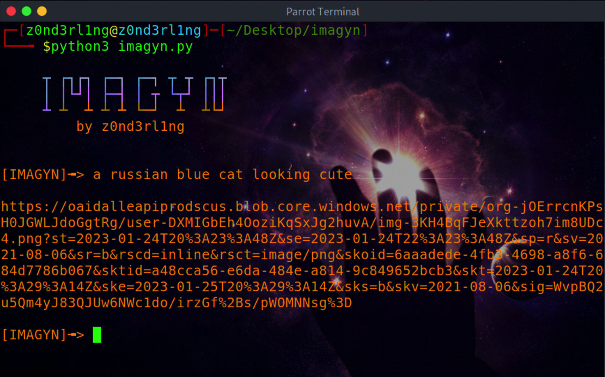
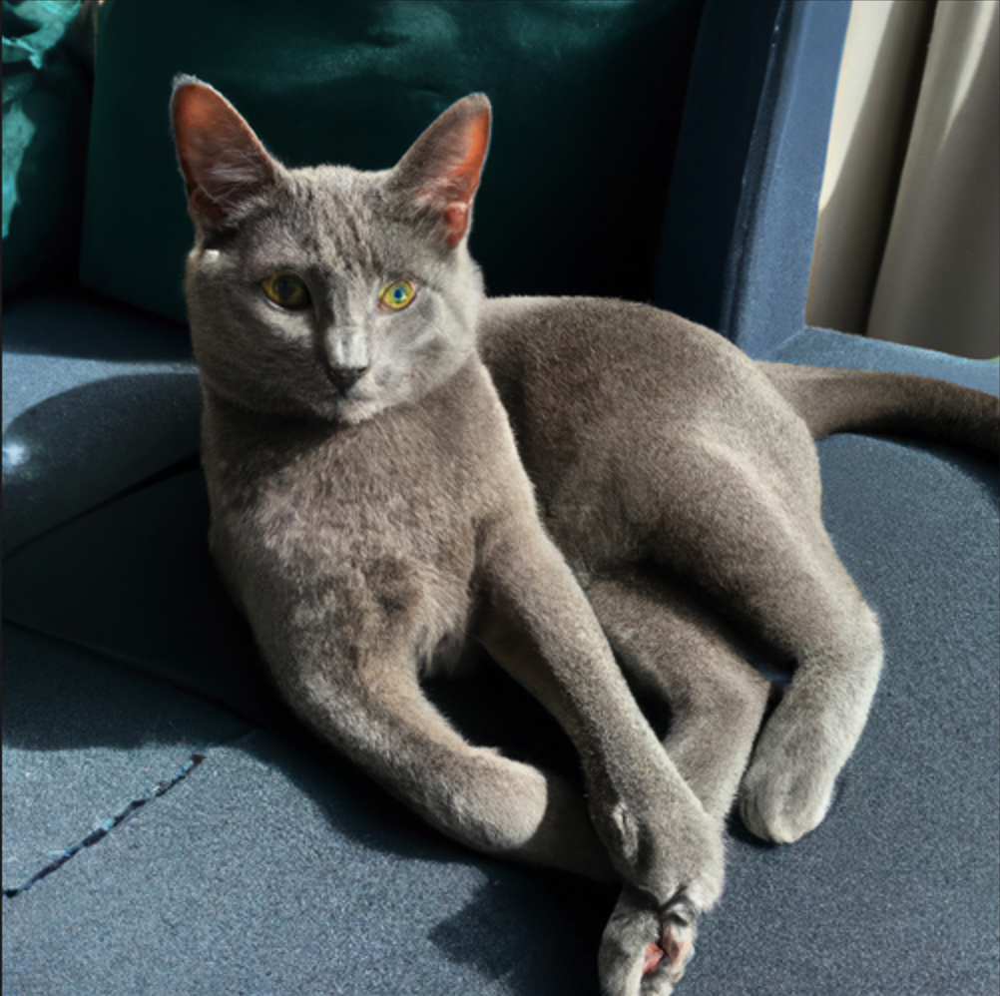

<h1>IMAGYN</h1>

AI image generator for terminal, using the openAI API

 

 <h3>GET STARTED</h3>

 create an <a href="https://beta.openai.com/account/api-keys">openAI API KEY</a> and paste it into the script!
         
         python3 imagyn.py

